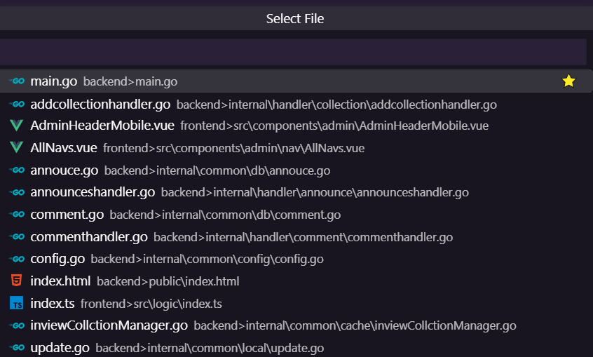

# recently-files-tree

[English Intro](README.MD) | [中文介绍](README-ZH.md)

vscode自带的最近文件 是以打开文件顺序排序, 本拓展是以目录结构顺序展开, 更容易寻找

## 特点

- 以文件路径排序
- 支持收藏
- 支持过滤

## 对比

vscode默认最近文件: 杂乱无章

本拓展基于文件路径排序, 而不是打开顺序, 更加符合常识

常规模式:

显示 `datail`

## 设置界面

可以添加忽略的文件后缀/忽略的文件/增大显示框

## TODO

? 增加选项: 按照原始的, 基于打开顺序

? 增加选项: 根据文件后缀过滤
